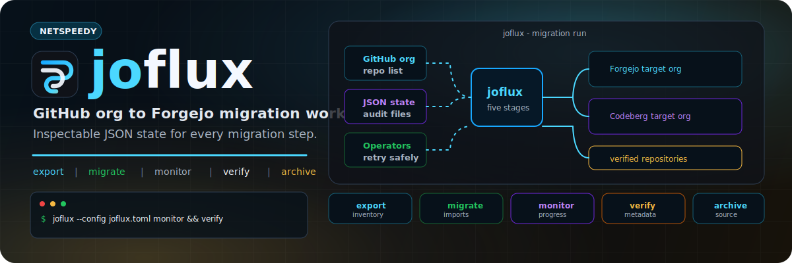

<p align="center">
  
</p>

<p align="center">
  <a href="https://github.com/netspeedy/joflux/actions/workflows/build-and-validate.yml"></a>
  <a href="https://github.com/netspeedy/joflux/releases"></a>
  <a href="https://github.com/netspeedy/homebrew-joflux"></a>
  <a href="https://www.python.org/"></a>
  <a href="LICENSE"></a>
  <a href="https://netspeedy.github.io/joflux/"></a>
</p>

joflux is a small command line workflow for moving repositories from a GitHub
organization into a Forgejo-compatible instance such as Codeberg. It exports a
GitHub inventory, starts Forgejo migrations, monitors progress, verifies the
target repositories, and can archive the GitHub originals once you are happy
with the result.

It is built for operators who want a repeatable migration run with files they
can inspect, retry, and keep as an audit trail.

**Docs:** [Website](https://netspeedy.github.io/joflux/) · [Configuration](docs/configuration.md) · [Usage](docs/usage.md) · [Release](docs/release.md) · [Releases](https://github.com/netspeedy/joflux/releases)

## Install

With Homebrew, after the first stable release is published:

```bash
brew tap netspeedy/joflux
brew install joflux
```

From source:

```bash
python3 -m venv .venv
source .venv/bin/activate
python -m pip install --upgrade pip
python -m pip install .
```

For development:

```bash
make install-dev
make test
```

## Configure

Copy the example config and add tokens with the required access:

```bash
cp joflux.toml.example joflux.toml
```

```toml
[github]
org = "my-github-org"
# token = "ghp_your_github_token"

[forgejo]
url = "https://codeberg.org"
org = "my-forgejo-org"
# token = "your_forgejo_or_codeberg_token"

[migration]
poll_interval = 30
max_wait_time = 3600
output_dir = "migration_output"
```

The GitHub token needs permission to list and clone the source organization
repositories. If you plan to run `archive`, it also needs permission to update
repository settings. The Forgejo or Codeberg token needs permission to create
repositories in the target organization.

Prefer environment variables for tokens so they are not written to disk:

```bash
export JOFLUX_GITHUB_TOKEN="ghp_your_github_token"
export JOFLUX_FORGEJO_TOKEN="your_forgejo_token"
```

For Codeberg targets, `JOFLUX_CODEBERG_TOKEN` is accepted as an alias for
`JOFLUX_FORGEJO_TOKEN`.

Old flat keys such as `github_org`, `codeberg_url`, `codeberg_org`, and
`codeberg_token` are still accepted, so earlier configs can be migrated
gradually. TOML is the default because it keeps joflux dependency-free; YAML is
accepted when the optional `joflux[yaml]` extra is installed.

## Run a migration

Export the GitHub repository inventory:

```bash
joflux --config joflux.toml export
```

Start migrations into the target Forgejo organization:

```bash
joflux --config joflux.toml migrate
```

Monitor progress:

```bash
joflux --config joflux.toml monitor
```

Verify the migrated repositories:

```bash
joflux --config joflux.toml verify
```

Archive the GitHub originals after you have reviewed the target repositories:

```bash
joflux --config joflux.toml archive --yes
```

Each command writes JSON state into `migration_output/` by default:

- `repos-inventory.json` stores the exported GitHub repositories.
- `migration-log.json` records migration start attempts.
- `migration-status.json` records monitor results.
- `verification-report.json` records verification summaries.
- `archive-log.json` records archive attempts.

## Safety notes

Run `export`, review `migration_output/repos-inventory.json`, and only then run
`migrate`. Use `--exclude-forks` or `--exclude-archived` during export if those
repositories should not move.

The `archive` command is intentionally separate from migration and asks for
confirmation unless `--yes` is supplied. It archives GitHub repositories; it does
not delete them.

Forgejo migration support depends on the target instance configuration. Some
instances may restrict private imports, metadata import, repository counts, or
background migration concurrency.

## Project status

joflux is a reworked public version of an older internal GitHub-to-Codeberg
migration helper. The current version keeps the original five-stage workflow but
packages it as a normal Python CLI with tests, release automation, and Homebrew
tap publishing.

## License

Released under the [MIT License](LICENSE).
